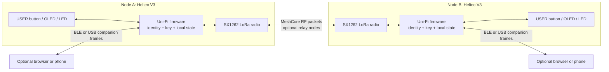
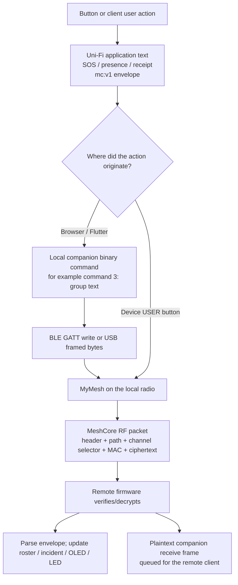
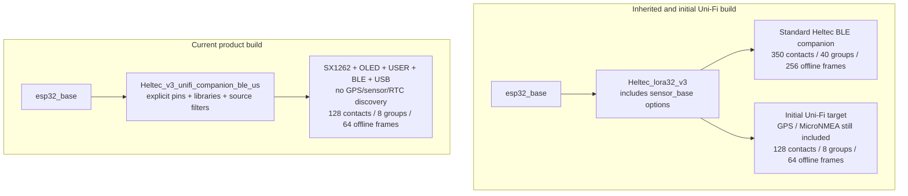
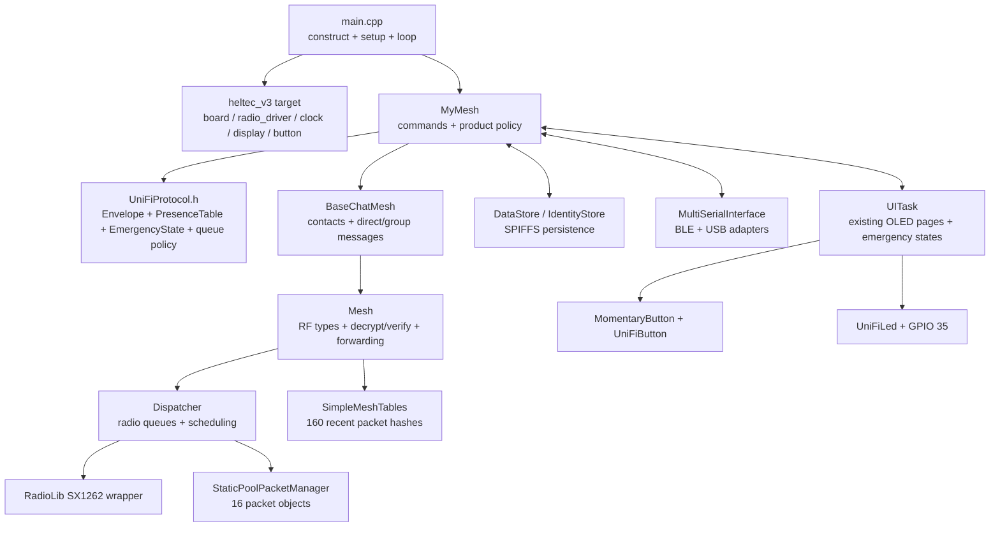
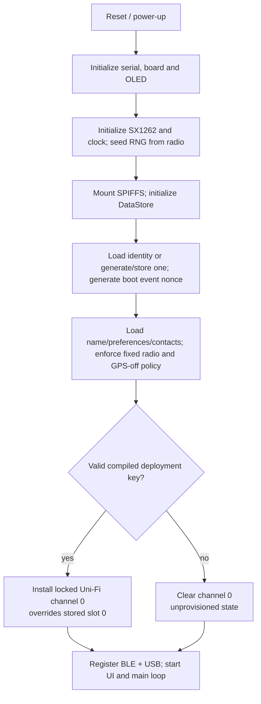
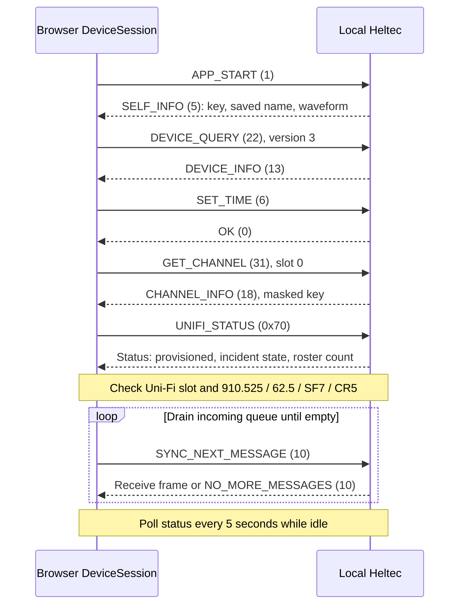
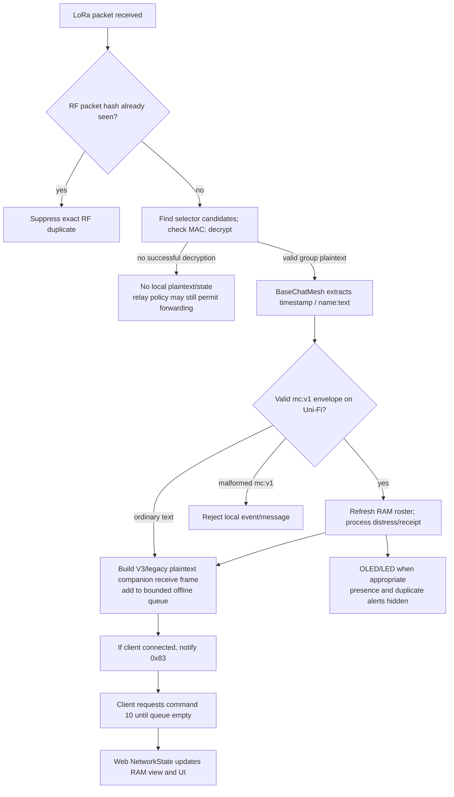
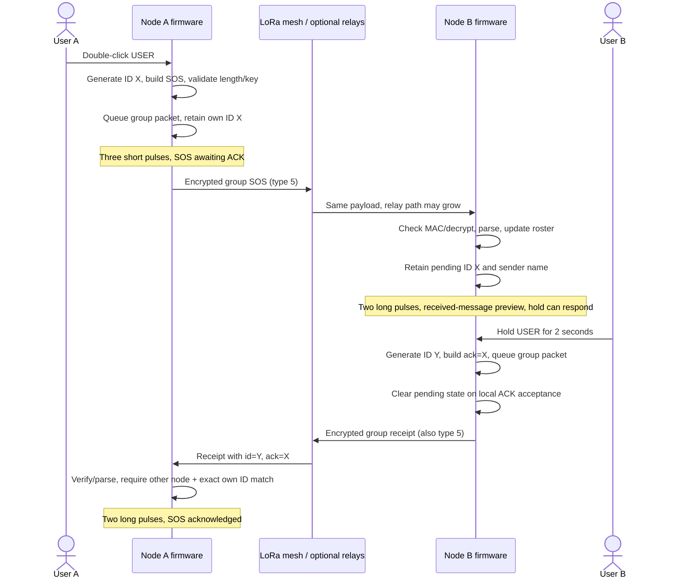
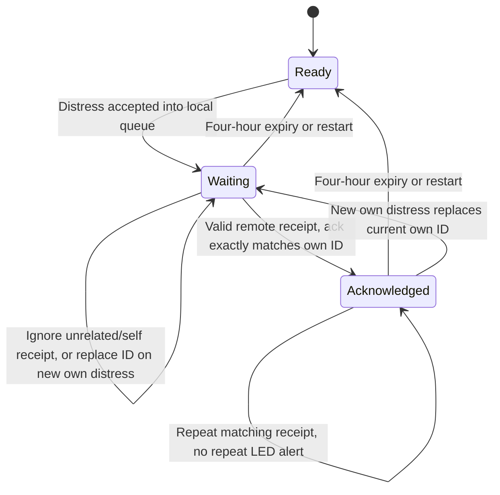
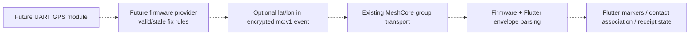

# Uni-Fi: structure, implementation and protocol walkthrough

Mesh network developed by MeshUSF. Documentation date: 2026-10-05.
Implementation snapshot: `fd8a149`, on `feat/heltec-v3-prototype`.

This is a ground-up explanation for a technical reader who has never seen the
project. It describes the **current GPS-free prototype**, not the complete
future product. Diagrams use Mermaid, which GitHub renders; directory trees
and byte layouts are plain text. All keys, names and IDs in examples are
illustrative. No deployment secret appears here.

## Reading guide

- [1. What we are building](#1-what-we-are-building)
- [2. The three protocol layers](#2-the-three-protocol-layers)
- [3. Original structure and the comparison baseline](#3-original-structure-and-the-comparison-baseline)
- [4. Current root directory tree](#4-current-root-directory-tree)
- [5. What was retained, excluded and changed](#5-what-was-retained-excluded-and-changed)
- [6. How the firmware modules fit together](#6-how-the-firmware-modules-fit-together)
- [7. Startup, the main loop and stored state](#7-startup-the-main-loop-and-stored-state)
- [8. Features and their implementation](#8-features-and-their-implementation)
- [9. Uni-Fi application envelope](#9-uni-fi-application-envelope)
- [10. MeshCore over-the-air format](#10-meshcore-over-the-air-format)
- [11. BLE and USB companion protocol](#11-ble-and-usb-companion-protocol)
- [12. Connection and incoming-message flow](#12-connection-and-incoming-message-flow)
- [13. Complete SOS and receipt flow](#13-complete-sos-and-receipt-flow)
- [14. Presence, expiry, duplicates and queue limits](#14-presence-expiry-duplicates-and-queue-limits)
- [15. Security and privacy boundaries](#15-security-and-privacy-boundaries)
- [16. Flutter, GPS and maps: what remains](#16-flutter-gps-and-maps-what-remains)
- [17. Verification and how to demonstrate the prototype](#17-verification-and-how-to-demonstrate-the-prototype)
- [18. Where to read the code next](#18-where-to-read-the-code-next)
- [Appendix A: retained companion commands](#appendix-a-retained-companion-commands)

## 1. What we are building

Uni-Fi is an off-grid **LoRa radio messaging system** based on MeshCore. It is
not Wi-Fi, a cloud messaging service, or a new replacement for MeshCore's radio
protocol. The Heltec V3 runs the radio, encryption, routing and minimal user
interface. A phone/browser is an optional, larger interface to that radio.

The current prototype has three software deliverables:

| Deliverable | Role | Current state |
| --- | --- | --- |
| `firmware/` | Heltec V3 device software | Product target compiles; host logic tests pass; physical acceptance pending |
| `web/` | Small real-device hardware-test client | BLE/USB implementations, protocol/session tests and browser layout checks; physical transport tests pending |
| `app/` | Existing Flutter mobile/web application | Earlier Uni-Fi customization retained; not newly slimmed or verified against this prototype |

The standalone device can queue SOS, receive distress, and send/recognize a
receipt without a phone. GPS is **not compiled into this target**. There is no
working location discovery or map in the current browser test client.



The RF path between nodes is independent of BLE and USB. Losing the phone
does not erase the radio's saved identity or deployment key. Losing device
power does erase its RAM-only presence, queued incoming messages and incident
state.

### Terms used throughout

| Term | Meaning here |
| --- | --- |
| Node | A radio running firmware; not a phone or a cloud account |
| Companion | A phone/browser connected locally to a node |
| Radio profile | Frequency and LoRa waveform settings shared by communicating radios |
| Group channel | An encrypted logical conversation identified using a shared key; not a separate RF frequency |
| PSK | Pre-shared deployment key; the same secret installed in fleet nodes |
| Device identity | MeshCore public/private key pair belonging to a node |
| Advert | Public signed MeshCore identity announcement, distinct from encrypted presence |
| Presence | Uni-Fi structured group message saying a member was recently heard |
| Flood | Neighbors relay a packet subject to routing policy and duplicate checks |
| Direct route | A packet follows a known sequence of node hashes; it may still cross relays |
| Receipt | A responder's explicit Uni-Fi `type=ack` message referring to an incident |

## 2. The three protocol layers

There are three formats, each solving a different problem. They must not be
treated as interchangeable:



1. **Uni-Fi envelope:** application meaning, such as “this is SOS event X.”
2. **Companion protocol:** commands and responses between the client and its
   own radio. It does not travel unchanged over LoRa.
3. **MeshCore RF protocol:** radio packet routing and encrypted group/direct
   messages. Uni-Fi reuses this format rather than inventing a new mesh stack.

There are also two different acknowledgements: MeshCore's direct-message hash
ACK, and Uni-Fi's human-triggered encrypted group receipt. Only the latter
changes the prototype's SOS receipt state. A local companion `OK` is neither.

## 3. Original structure and the comparison baseline

There is an important historical limitation: the first repository import,
`43cfeef`, **already contained initial Uni-Fi modifications**. There is no
pristine, pre-Uni-Fi upstream snapshot in this Git history. We can describe
the inherited MeshCore/MeshCore Open structure from the source, but cannot
claim an exact pristine-upstream diff.

For an exact **before this prototype / after this prototype** comparison:

- Before: `80062a7`, the organization's integrated `main` before this work.
- Firmware prototype: `c0b22b9`.
- New browser client: `925d9e0`.
- Tests/build CI: `bd79e85` and `593b3a6`.
- Decisions and validation documentation: `fd8a149`.

Across `80062a7..fd8a149`, 43 paths were added or modified, **zero files were
deleted**, and `app/` was unchanged. “Trimmed firmware” means a narrower
compiled product, not a physically stripped-down source repository.

### Inherited source organization

This is a selective tree, showing module boundaries rather than every file:

```text
Uni-Fi/
├── firmware/                         MeshCore C++ codebase
│   ├── platformio.ini                Platform bases, build matrix, native tests
│   ├── variants/                     Hardware-specific targets
│   │   └── heltec_v3/                Board wiring, radio/display/clock objects
│   ├── boards/                       PlatformIO board descriptions
│   ├── src/
│   │   ├── MeshCore.h                Interfaces, sizes and common constants
│   │   ├── Packet.*                  Packet representation and serialization
│   │   ├── Identity.*                Device keys, signing and key exchange
│   │   ├── Dispatcher.*              Radio scheduling and packet handling
│   │   ├── Mesh.*                    Routing, decrypt/verify, receive callbacks
│   │   ├── Utils.*                   Encryption, hashing and encoding helpers
│   │   └── helpers/
│   │       ├── BaseChatMesh.*         Contacts, direct and channel messaging
│   │       ├── StaticPoolPacketManager.*
│   │       ├── SimpleMeshTables.h     Recently seen RF packet hashes
│   │       ├── IdentityStore.*        Persistent identity
│   │       ├── ArduinoSerialInterface.*
│   │       ├── MultiSerialInterface.h
│   │       ├── esp32/, nrf52/, stm32/, ethernet/
│   │       ├── radiolib/              Radio hardware adapters
│   │       ├── sensors/               GPS and environmental sensors
│   │       ├── bridges/               Bridge implementations
│   │       └── ui/                    Display, button, buzzer/vibration drivers
│   ├── examples/
│   │   ├── companion_radio/
│   │   │   ├── main.cpp              Setup and main loop
│   │   │   ├── MyMesh.*               Companion commands/product behavior
│   │   │   ├── NodePrefs.h            Saved configuration
│   │   │   ├── DataStore.*            Preferences/contacts/channels storage
│   │   │   ├── AbstractUITask.h       Local-feedback interface
│   │   │   └── ui-new/                OLED UI; other UI versions also retained
│   │   ├── simple_repeater/
│   │   ├── simple_room_server/
│   │   ├── simple_secure_chat/
│   │   ├── simple_sensor/
│   │   └── kiss_modem/
│   ├── arch/, lib/, bin/              Architecture/library/tool support
│   ├── test/                         Native tests
│   └── docs/                         Inherited technical references
├── app/                              MeshCore Open-derived Flutter app
│   ├── lib/
│   │   ├── main.dart                 Constructs app services and providers
│   │   ├── connector/                Companion protocol + BLE/USB/TCP state
│   │   ├── models/                   Contacts/channels/messages/settings
│   │   ├── screens/                  Chat, contacts, maps, settings and more
│   │   ├── widgets/                  Reusable UI and navigation
│   │   ├── services/                 Retry/notification/map/image/translation
│   │   ├── storage/                  Persisted client data
│   │   └── helpers/, utils/, theme/, icons/, l10n/
│   ├── android/, ios/, web/          Platform runners
│   ├── linux/, macos/, windows/      Desktop runners
│   ├── assets/, test/, tools/, scripts/
│   └── documentation/               Client guides
├── docs/                             Uni-Fi decisions/security/protocol/log
├── scripts/gitw                      Workspace Git wrapper
├── README.md
└── LICENSE
```

The original architecture was deliberately broad: many boards and device
roles in firmware, and a feature-rich cross-platform client. Those modules
were useful upstream, but most are unnecessary for one Heltec emergency node.

## 4. Current root directory tree

The inherited trees remain. The prototype adds the following focused modules:

```text
Uni-Fi/
├── firmware/                         Existing core + product-specific changes
│   ├── variants/heltec_v3/
│   │   ├── platformio.ini            Explicit minimal Uni-Fi build target
│   │   ├── HeltecV3Board.h            Product OLED rail control
│   │   └── target.{h,cpp}             Hardware object selection
│   ├── examples/companion_radio/
│   │   ├── MyMesh.{h,cpp}             Modified command/receive/emergency flow
│   │   ├── UniFiProtocol.h            NEW bounded parser, state and queue policy
│   │   ├── main.cpp                  BLE + USB and cooperative loop
│   │   └── ui-new/UITask.{h,cpp}       Modified original OLED interface
│   ├── src/helpers/ui/
│   │   ├── UniFiButton.h              NEW pure debounce/gesture controller
│   │   ├── UniFiLed.h                 NEW pure nonblocking pattern controller
│   │   └── MomentaryButton.*          Existing GPIO adapter, modified
│   └── test/unifi_host/
│       ├── test_controls.cpp          NEW real controller logic tests
│       └── test_protocol.cpp          NEW envelope/state/queue/routing tests
├── app/                              Preserved Flutter foundation; unchanged
├── web/                              NEW lightweight hardware-test client
│   ├── index.html, style.css, icon.svg
│   ├── app.js                        Rendering and user actions
│   ├── transports.js                 Real Web Bluetooth / Web Serial
│   ├── protocol.js                   Binary framing and envelope codec
│   ├── session.js                    Commands, initialization, state, draining
│   ├── test/                         Node protocol/session tests
│   ├── package.json                  No runtime/package-install dependencies
│   └── README.md
├── scripts/
│   ├── gitw
│   ├── provision-unifi.py            NEW private provisioning-header generator
│   └── test-unifi.sh                 NEW strict C++ + Node test entry point
├── .github/workflows/unifi-prototype.yml
└── docs/                             Decisions, validation and this walkthrough
```

Do not confuse root `web/` with `app/web/`: the former is our new small test
client; the latter is the Flutter web platform runner.

These local paths are **not committed source**:

```text
firmware/examples/companion_radio/UniFiProvisioning.h   private ignored PSK header
firmware/.pio/                                        generated builds/dependencies
output/playwright/                                   ignored browser screenshots
.git-data/                                           local workspace Git database
```

The private header and provisioned binaries contain the deployment secret.
Open-source source code does not require publishing those files.

## 5. What was retained, excluded and changed

### Build selection: the key structural change



The smaller contact/channel/offline limits were introduced in the **initial
Uni-Fi import**, not newly invented in the latest prototype. This iteration
removes inherited build coupling and makes the selected product runtime
explicit. `lib_ldf_mode=chain+` avoids pulling libraries from inactive
preprocessor branches. Product behavior is gated by `UNIFI_MINIMAL` and
`ENABLE_UNIFI_NETWORK`, preserving unrelated upstream targets.

### Module change map

| Component | What we did | Why / current boundary |
| --- | --- | --- |
| `Packet`, `Identity`, `Dispatcher`, `Mesh` | Retained core formats and implementation | Avoid a new incompatible routing/crypto stack |
| RadioLib SX1262 adapters | Retained with explicit Heltec wiring | Necessary LoRa hardware support |
| `BaseChatMesh`, contacts and group/direct text | Retained; guarded outgoing group length | Keep core messaging; reject truncation of event metadata |
| `DataStore`, `IdentityStore`, `NodePrefs`, SPIFFS | Retained | Saved names, identity, preferences and contacts survive restart |
| `MyMesh` | Modified | Product allowlist, provisioning, presence, receipts, forwarding, queue policy |
| `UniFiProtocol.h` | Added | Allocation-free parser/state logic directly exercised by host tests |
| `MomentaryButton` + `UniFiButton.h` | Modified/added | One usable app button; debounce and safe gestures |
| `UITask` + `UniFiLed.h` | Modified/added | Preserve basic OLED UI; deterministic nonblocking alert patterns |
| OLED Vext controller | Modified for this target | Active-low power ownership, timeout and wake/reinitialization |
| USB companion interface | Enabled and hardened | Prototype test path; expiry of stale connection state; oversized frames dropped |
| GPS / MicroNMEA | Excluded, source retained | Hardware integration deferred; cannot enable it by toggling a preference |
| Environmental sensor implementations | Not selected in product build | No unused device probing or associated drivers |
| External RTC discovery and RX8130CE driver | Explicitly excluded | Use the ESP32 software-backed clock instead |
| Wi-Fi/TCP, Ethernet, bridges | Not selected in product target | BLE is the normal companion path; USB is a bench-test alternative |
| Image/group datagrams, raw/control send, remote telemetry/admin | Companion commands blocked or code gated | Text-only emergency prototype; no expert workflows required |
| Private-key import/export, signing commands, rescue filesystem CLI | Disabled/gated | Reduce exposed product operations; this does not remove core advert signatures |
| Ordinary TX LED indication | Not defined for this target | Prevent the radio driver from corrupting emergency blink patterns |
| Other boards, device roles and UI drivers | Left in repository; not selected | Preserve upstream code, licensing and future comparison |
| Flutter application | Earlier customization kept; no changes this iteration | Separate mobile pruning/compatibility milestone |
| Browser hardware-test client | Added separately | Small, testable client without the Flutter dependency tree |

“Excluded” is not always “every referenced symbol disappears”: shared base
classes, virtual callbacks and generic helper source can remain. The verified
claim is that the selected product functionality is disabled and key unused
implementations are absent from the linked image—not a total rewrite of the
repository or an independently measured speedup.

## 6. How the firmware modules fit together

The inherited C++ stack is layered by inheritance:

```text
MyMesh                         Uni-Fi product + companion commands
  inherits BaseChatMesh        Contacts and text conversations
    inherits mesh::Mesh        Packet types, decryption, routing
      inherits Dispatcher      Radio scheduling, receive/send processing
```

Hardware is supplied through objects/interfaces, so radio scheduling need
not know about a particular OLED or button. `MyMesh` also implements the
`DataStoreHost` interface used to load/save contacts and channels.



Key responsibilities:

- `UniFiProtocol.h` contains no Arduino, GPIO or radio dependency. Its parser,
  gesture-independent incident state and queue rules are the **same code**
  compiled into firmware and tested on the host.
- `MyMesh` connects that pure logic to received packets, commands and UI.
- `BaseChatMesh` creates regular MeshCore group/direct messages.
- `Mesh` handles MAC checking, decryption, advert signatures and routing.
- `Dispatcher` schedules actual radio work. UI acceptance does not mean the
  dispatcher has completed a transmission.

## 7. Startup, the main loop and stored state

### Startup



The deployment key is created by `scripts/provision-unifi.py` in an ignored
header. It is not fetched from a server. The generator uses 16 random bytes,
Base64-encodes them, creates the file with private permissions, and refuses
to overwrite it. Clean the build after adding/changing provisioning to avoid
reuse of objects built under a different header state.

The node loads stored preferences, but the product overrides frequency,
bandwidth, spreading factor and coding rate. GPS and remote telemetry stay
off. A missing compiled key clears slot 0 even if old provisioning was saved
in flash. Such a build cannot send Uni-Fi group events or relay fleet traffic.

### Cooperative loop

The main loop runs mesh work, local interfaces, the empty sensor manager,
UI work and clock updates, then yields with `delay(1)` for ESP32 background
tasks. Button and LED controllers use elapsed-time checks, not long blocking
blink delays. BLE remains active while the OLED sleeps.

This is **not a deep-sleep battery guarantee**. The radio still needs to
receive/relay, and the ESP32 BLE stack remains available. Runtime CPU frequency
is set to 80 MHz; actual latency, heap and current need hardware measurement.

### Who owns each piece of state?

| Data | Owner / storage | Survives restart? |
| --- | --- | --- |
| Device public/private identity | Heltec, persistent identity store | Yes |
| Saved username and preferences | Heltec, SPIFFS | Yes |
| Contacts and other configured channels | Heltec, SPIFFS | Yes |
| Authoritative deployment PSK | Compiled firmware/header; installed into channel 0 | Yes, by boot provisioning |
| Authorized-presence roster | Heltec, 32 RAM entries, local four-hour TTL | No |
| Current own distress + newest pending received distress | Heltec RAM | No |
| Recent distress/receipt duplicate cache | Heltec RAM, 16 entries | No |
| Incoming offline companion queue | Heltec RAM, 64 frames | No |
| Browser roster, incidents and messages | Browser RAM: 128 / 100 / 150 bounds | No; reload/fresh session clears them |
| Flutter chat/received-time storage | Existing app persistence | Intended persistent behavior; current compatibility unverified |

“Offline queue” means received messages waiting for a companion to collect
them. It is different from the dispatcher's outbound RF packet queue.

## 8. Features and their implementation

| Feature | Implementation | Important limitation |
| --- | --- | --- |
| Saved node name | Companion command 8; validate, save prefs, read self-info back | Not a cloud account or individually authenticated identity |
| Fixed radio | Target flags and boot overrides; command 11 disabled | Requested profile is not a regulatory certification |
| Shared-key group | Compile-time PSK, locked slot 0, masked reads, rejected writes | Key extraction and key-holder impersonation are possible |
| Standalone SOS | Double-click → `sendEmergencyMessage` → structured group message | Local queue acceptance, not delivery; no GPS attached |
| Standalone receipt | Hold → latest pending event ID → `type=ack` group message | One newest pending incident on device; not emergency dispatch |
| Phone-independent reception | Mesh receive callback updates RAM and local UI | Device must be powered and in radio range |
| Quick presets | Browser `sendEvent` for SOS/medical/pickup/safe/enroute | Only SOS and receipt have dedicated button gestures |
| Presence | Structured encrypted heartbeat and roster update | Four-hour freshness does not imply a node is still online |
| Fleet routing | Provisioned nodes forward allowed types with flood cap | No guaranteed path, bandwidth or delivery |
| Screen timeout | OLED sleeps after 10 s; active-low Vext release; wake reinitializes | Physical display/power behavior remains untested |
| Web diagnostics | Real BLE/USB frames, serialized commands, status polling | Browser/OS BLE MTU and pairing need hardware tests |

### Buttons

The board supplies RESET and USER/BOOT. RESET is not a second application
button. USER is GPIO 0; holding it while resetting can enter the bootloader.

| Gesture | Current behavior |
| --- | --- |
| One click | Wake a sleeping display, otherwise advance a page |
| Two clicks | Queue one SOS from any page |
| Hold for 2 s | If a received distress is pending, queue its receipt; otherwise select the current page action, such as BLE toggle/hibernate |
| Held through boot | Suppressed as an emergency gesture |

The controller debounces for 30 ms and uses a 280 ms multi-click completion
window. Hold consumes the pending click sequence, preventing a hold from also
becoming SOS. These timers are tested across 32-bit millisecond rollover.

### OLED and LED

The original `ui-new` interface remains, with Uni-Fi home state, recent
network members, radio/BLE information and hibernate. GPS/sensor and manual
advert pages are not part of this product UI.

GPIO 35 has one alert writer; normal radio-TX LED control is disabled:

| Indication | Meaning | Timing |
| --- | --- | --- |
| Three short pulses | A distress was accepted locally for transmission | 160 ms on / 180 ms off between pulses |
| Two long pulses | New received distress **or** a matching reply to our distress | 650 ms on / 300 ms off between pulses |

Received indications have priority over sent ones. The single LED cannot
distinguish those two received cases by color; the OLED distinguishes them.
Unrelated/self ACKs do not acknowledge our event. Ordinary presence must not
wake the OLED or blink emergency feedback.

“SOS failed” / “Response failed” means the application could not queue the
message. A later RF failure or absent reply does not retrospectively make a
queued message delivered. There is no automatic SOS retry-until-receipt loop.

## 9. Uni-Fi application envelope

The envelope is an ASCII metadata block at the **end** of ordinary encrypted
group text. The radio adds its saved username before the message:

```text
<saved name>: <readable label> [mc:v1;type=...;id=...;node=...]
```

Exact GPS-free example received on another node, 78 UTF-8 bytes:

```text
Sanjay: SOS [mc:v1;type=sos;id=AABBCCDDEEFF1234ABCD00000001;node=AABBCCDDEEFF]
```

A responder sends a **new** message with its own node and event ID, referring
to the original ID using `ack`. This example is 120 bytes including the name:

```text
Dispatcher: Received [mc:v1;type=ack;id=11223344556689ABCDEF00000001;node=112233445566;ack=AABBCCDDEEFF1234ABCD00000001]
```

Presence uses the same format:

```text
Sanjay: Available [mc:v1;type=presence;id=AABBCCDDEEFF1234ABCD00000002;node=AABBCCDDEEFF]
```

### Exact field rules

| Field | Requirement |
| --- | --- |
| `type` | Required; exactly `presence`, `sos`, `medical`, `pickup`, `safe`, `enroute`, `location`, or `ack` |
| `id` | Required; 1–32 ASCII letters/digits/underscore/hyphen; case-sensitive |
| `node` | Required; first six public-key bytes encoded as exactly 12 hex characters; hex case is accepted either way |
| `ack` | Required only for `type=ack`; forbidden for other types; same ID character/length rules |
| `lat`, `lon` | Optional but must occur together; fixed decimal syntax, finite, latitude −90..90, longitude −180..180; `(0,0)` accepted by firmware/web |

Unknown or repeated fields, multiple `mc:v1` blocks, missing final `]`, NUL
bytes and malformed values are rejected. Field order is not significant.
The current GPS-free event generator supplies no coordinates. Valid optional
coordinates from a received or manually supplied envelope can still be parsed
and forwarded; that does not give this device a GPS provider. A `location`
type is recognized as an extension, but does not by itself imply a valid fix.

The firmware validates incoming `name: ` separately: 1–31 bytes, no control
bytes, DEL, colon or brackets. Browser name input also rejects leading/trailing
whitespace and decodes incoming UTF-8 strictly. Firmware byte checks are not a
complete Unicode validator; do not assume identical validation in old Flutter.

### Length and identity checks

The complete **decrypted text including `name: `** must fit 160 bytes.
This is a byte budget, not a character count. Timestamp/type bytes in the RF
payload are additional. Both web and firmware reject oversized outgoing text
instead of letting the base group sender truncate the final metadata block.

On a structured outgoing slot-0 message, the firmware checks that `node`
matches its own six-byte public-key prefix. On reception, group encryption
does not cryptographically bind the claimed `node` or name to a device.
Full public keys arrive separately in signed adverts; prefix correlation is
for discovery/contact association, not proof of the group message's author.

### Event ID generation

```text
Hardware-generated ID (28 characters):
  node prefix [12 hex] + per-boot random nonce [8 hex] + sequence [8 hex]

Browser-generated ID (20 characters):
  node prefix [12 hex] + crypto.getRandomValues random value [8 hex]
```

The firmware nonce is generated after setup seeds its RNG from the radio.
The sequence differentiates actions in the same millisecond; the nonce reduces
collision across restarts. IDs are correlation tokens, not cryptographic
signatures or a mathematical guarantee that collisions cannot happen.

## 10. MeshCore over-the-air format

This section describes the **vendored code**, not an invented Uni-Fi radio
standard. The current packet payload version is MeshCore V1, encoded as zero
in the header. That is separate from companion protocol version 3 and the
`mc:v1` application marker.

### Outer packet

```text
Offset varies with transport/path mode:

[header:1]
[transport codes:4, ONLY for transport-flood / transport-direct]
[path metadata:1]
[path entries: count × hash-width]
[payload: remaining bytes]

header bits:
  7..6 = payload version (0 for current V1)
  5..2 = payload type (5 for group text)
  1..0 = route type (1 flood; 2 direct; 0/3 transport variants)

path metadata bits:
  7..6 = hash-width minus 1 (0→1 byte, 1→2 bytes, 2→3 bytes; 3 reserved)
  5..0 = number of path entries
```

A normal freshly originated group-text flood has header `0x15`: version 0,
type 5, route 1. With one-byte hashes and no relay entries, path metadata is
`0x00`. Persisted path-hash settings may select another supported width.
Product boot clears default transport/flood scope; normal Uni-Fi events use
ordinary flood routing, not transport-region scoping.

Core bounds are 184 payload bytes, 64 path bytes, and a 255-byte transfer
unit. Path validity and available payload/packet space still constrain each
packet; these are not three simultaneously usable application budgets.

### Group-text payload and encryption

```text
RF payload (visible selector, encrypted content):
  [channel selector:1][MAC:2][ciphertext: multiple of 16 bytes]

Before encryption:
  [timestamp:uint32 little-endian][text type:1 = 0 plain][UTF-8 "name: message"]

Current fleet key construction:
  K16 = 16 bytes decoded from the private Base64 provisioning header
  selector = first byte of SHA-256(K16)
  stored secret = K16 followed by 16 zero bytes
  ciphertext = AES-128 block encryption using K16, zero-padded final block
  MAC = first 2 bytes of HMAC-SHA256(stored 32-byte secret, ciphertext)
```

In this implementation each block is encrypted independently: inherited
**AES-128 ECB**, not AES-GCM, with no per-message IV in this packet format.
The two-byte MAC is also inherited; it is a short tag, not strong per-device
authentication. It covers ciphertext, not the outer routing header/path. We
did not add a new cipher or upgrade these properties.

Receivers first match the one-byte selector against configured channels, then
try MAC verification/decryption with their actual keys. Selector equality
alone does not grant access. Cipher padding is removed logically by text/NUL
handling; the received timestamp is not the clock used for our four-hour TTL.

### Public adverts and direct text

Public adverts are not group-encrypted. Their payload is:

```text
[public key:32][timestamp:4][Ed25519 signature:64][advert app data]
```

The signature covers public key + timestamp + app data. The Uni-Fi advert
announces the opaque label `UniFi-<first four public-key bytes in hex>`, the
chat node type, and no GPS. It supplies the full key needed for contact/direct
messaging; it does **not** prove fleet membership.

Retained direct text uses MeshCore payload type 2, recipient/source one-byte
hashes, a two-byte MAC, and encrypted timestamp/flags/text. Its shared secret
comes from the two device identities' existing key-exchange implementation,
not the fleet group PSK. Known paths use direct routing; unknown paths flood.
The direct-message acknowledgement is payload type 3 and starts with a
four-byte message hash; a plain-text ACK can also carry an attempt byte and
random byte (six bytes total). That ACK is not our application `type=ack` receipt.

### Forwarding

Provisioned nodes relay configured encrypted group text, chat adverts, direct
text, direct ACK and PATH traffic. Group forwarding uses a configured nonzero
key's **selector hash as a traffic filter**, not decryption/authentication as
a prerequisite to forwarding. A hash collision or invalid-MAC packet may be
relayed without being accepted into local Uni-Fi state. For the normal flooded
adverts generated here, the core checks signatures before receive/forward.
Intermediate handling of nonempty direct routes occurs earlier in the core,
so this is not a promise that every relayed packet is cryptographically checked.

For flood packets, `MyMesh::allowPacketForward` refuses forwarding when the
incoming path already contains three relay entries. The core appends the
local node hash on a permitted retransmission. This is a **three-relay
forwarding cap**, not an exact three-radio/link topology guarantee; a final
receiver can receive a packet already carrying three entries without relaying
it again. Direct routes retain the core's route/path limits rather than this
specific flood count check.

The dispatcher keeps inherited scheduling, airtime budgeting and delayed
retransmission. We have not measured throughput or changed LoRa into a
reliable stream transport.

## 11. BLE and USB companion protocol

Companion frames are binary local commands/responses with code in byte 0.
All numeric multi-byte fields shown below use little-endian on this target.
The firmware cap is **176 bytes** (`BaseSerialInterface.h`); the web client's
outgoing cap is a conservative **172 bytes**, and its USB receiver accepts up
to 176. Neither number is the 160-byte group-text budget.

### Transport framing

| BLE Nordic UART Service | UUID |
| --- | --- |
| Service | `6e400001-b5a3-f393-e0a9-e50e24dcca9e` |
| RX, client writes to device | `6e400002-b5a3-f393-e0a9-e50e24dcca9e` |
| TX, device notifications to client | `6e400003-b5a3-f393-e0a9-e50e24dcca9e` |

One BLE characteristic write is one complete companion command. The web
client uses write-with-response; it does not split a command into separate
writes. A BLE write response acknowledges the local GATT operation, not RF
delivery. Firmware requires encrypted MITM-authenticated pairing. It uses a
session PIN when a display is available and no saved PIN overrides it;
fallback/saved PIN behavior remains inherited. OS pairing and effective MTU
must be tested; we do not guarantee every browser can write the largest frame.

USB uses 115200 baud and a three-byte wrapper:

```text
Client → device: [0x3C '<'][length low][length high][companion command bytes]
Device → client: [0x3E '>'][length low][length high][companion response bytes]
```

Length excludes the three-byte wrapper. USB may fragment/combine reads; the
browser decoder buffers until a complete frame and tolerates unrelated boot
text. Oversized incoming commands are discarded in the product firmware,
not truncated into a different command. There is no special LoRa encryption
inside USB framing: the attached computer receives already-decrypted text.

### Essential outgoing commands: exact layouts

```text
APP_START (1):
  [0:0x01][1..7:reserved zero][8..:client label, e.g. "Uni-Fi Web"]
  → SELF_INFO (5)

DEVICE_QUERY (22):
  [0:0x16][1:0x03 desired companion message version]
  → DEVICE_INFO (13); selects V3 received-message layout

SET_TIME (6):
  [0:0x06][1..4:Unix seconds uint32]
  → OK (0)

SET_NAME (8):
  [0:0x08][1..:UTF-8 name bytes, no transmitted NUL required]
  → OK (0); browser then APP_START/readback

SEND_CHANNEL_TEXT (3):
  [0:0x03][1:text type=0][2:channel index=0]
  [3..6:Unix seconds uint32][7..:message body WITHOUT "name: "]
  → OK (0) if queued, or error

SEND_DIRECT_TEXT (2), retained but not exposed by this web test UI:
  [0:0x02][1:text type=0][2:attempt]
  [3..6:timestamp][7..12:recipient public-key prefix][13..:text]
  → SENT (6) / error; delivery confirmation uses separate direct ACK flow

GET_CHANNEL (31):
  [0:0x1F][1:channel index]
  → CHANNEL_INFO (18); slot 0 secret bytes masked to zero

SYNC_NEXT_MESSAGE (10):
  [0:0x0A]
  → next received message frame, or NO_MORE_MESSAGES (10)

UNIFI_STATUS (112 / 0x70):
  [0:0x70]
  → fixed 101-byte status frame starting 0x70
```

The send body is not prefixed by the browser: the firmware prepends its saved
name. No deployment key is sent by the browser. Other channel slots retain
configuration commands, but slot 0 replacement is rejected.

### Self-info and received channel frames

Self-info response `5` gives the client these offsets:

| Offset | Bytes | Meaning |
| --- | --- | --- |
| 0 | 1 | Response code 5 |
| 1 | 1 | Node advert type |
| 2, 3 | 1 each | Current/max TX power |
| 4 | 32 | Full node public key |
| 36, 40 | 4 each | Latitude/longitude microdegrees; zero by default in GPS-free build |
| 44..47 | 4 | Multi-ACK, advert-location, telemetry and manual-contact flags |
| 48 | 4 | Frequency × 1000, i.e. 910525 for 910.525 MHz |
| 52 | 4 | Bandwidth × 1000, i.e. 62500 for 62.5 kHz |
| 56, 57 | 1 each | SF 7 and coding-rate value 5 (4/5) |
| 58 onward | variable | Saved node name |

The channel-info response is 50 bytes: code 18, index, 32-byte name field,
16-byte PSK field. For slot 0 that PSK field is always zero. **Zeros are not
evidence of missing provisioning**; use product status.

Received channel text layout is V3 after the query requests version 3:

```text
V3:
[0:17][1:signed SNR × 4][2..3:reserved]
[4:channel index][5:packed RF path metadata, or 0xFF direct]
[6:text type=0][7..10:sender timestamp][11..:UTF-8 "name: message"]

Legacy:
[0:8][1:channel index][2:path metadata][3:text type=0]
[4..7:sender timestamp][8..:UTF-8 "name: message"]
```

The path byte is **not always the hop count**: use its width/count bit fields
when it is a packed flood path. No full RF packet/header/ciphertext is needed
by the web client to parse a normal received channel frame.

### Product status extension: exact response

| Offset | Bytes | Meaning |
| --- | --- | --- |
| 0 | 1 | `0x70` |
| 1 | 1 | Status version `1` |
| 2 | 1 | Flags below |
| 3 | 1 | Locked network channel index `0` |
| 4 | 32 | Current own distress ID, zero-padded |
| 36 | 32 | Newest pending received distress ID, zero-padded |
| 68 | 32 | Pending sender name, zero-padded |
| 100 | 1 | Current retained firmware member count |

Flags: bit 0 provisioned; bit 1 own distress awaiting receipt; bit 2 own
distress acknowledged; bit 3 received distress pending; bit 4 GPS compiled;
bit 5 fleet relay enabled. It exposes no PSK, full roster, coordinates,
incident history, timestamp or incident type. The web can reconstruct an own
incident after reconnect, but currently labels that synthesized card SOS
even if the original distress came from another distress preset.

Generic response meanings: `0` is local OK; `1` is error followed by error
code; `15` is disabled. Code `0x83` is an asynchronous “messages waiting”
push, not a message body. Code `10` responding to command `10` means the
incoming queue is empty.

## 12. Connection and incoming-message flow

The browser has no server-side account, cloud database or mock device mode.
Its modules are:

```text
app.js         user actions and safe text-based DOM rendering
session.js     DeviceSession + serialized CommandQueue + NetworkState
protocol.js    binary offsets, envelope encoding/validation, USB decoder
transports.js  actual BLE GATT and USB serial operations
```

### Handshake



Setting time uses the inherited forward-only check: a timestamp earlier than
the node's current time is rejected. An unexpectedly future node clock can
therefore prevent this handshake; local TTL still does not trust sender time.

Transmit controls stay disabled until successful initialization. Explicitly
unprovisioned firmware is rejected. For older firmware that rejects status,
the client keeps an explicitly **unverified legacy** mode and polls time
every 15 seconds; a slot name alone cannot establish key validity.

Commands have no request ID. The web queues them one at a time, associates
the response code with the active command, and handles asynchronous pushes
separately. Default command timeout is six seconds. Timeout/write failure
closes the session rather than letting a delayed generic OK complete a later
command. Use one controlling client per node: BLE and USB share the command
state, and responses can be written to both registered interfaces.

USB connection state is inferred from completed incoming frames and expires
after 30 seconds without activity. Five-second polling keeps it active; a
disconnected cable will not leave the UI permanently believing a companion
is present.

### Reception and companion collection



The firmware queues incoming messages even when a client is connected. The
push is just a prompt to pull them. A new browser session can drain queued
messages and query the current incident status, but cannot request a complete
firmware roster dump; browser presence may differ from the 32-member device
table.

## 13. Complete SOS and receipt flow



The browser can substitute for either button action: command 3 submits the
same event body, and firmware handles own/pending incident state through the
same group-message wrapper. Status polling lets it see a physical-button SOS
and a receipt received while the browser was absent.

On incoming distress, the immediate OLED page is the received-message preview.
The `Hold 2s: ACK` prompt appears on the home page; the hold gesture can respond
from either page. We have not yet polished that raw-envelope preview into a
dedicated minimal incident screen.

### What the states actually prove



- Queued: the local firmware accepted a message, not that another node heard it.
- Received distress: this receiver decoded a valid event, not that a dispatcher
  or emergency service has been contacted.
- Receipt queued on B: B accepted its response locally; B clears its pending
  state at this point even if A never receives that response.
- Acknowledged on A: a different claimed node holding the group key sent a
  matching receipt. It does not guarantee assistance or identify a trusted person.

Each node retains **one current own distress** and **one newest pending received
distress**. A later incoming distress replaces the pending one, so a hardware
hold is not a menu of every victim. Browser incident cards can retain multiple
events and respond to a selected ID. Power loss loses standalone incident state.

## 14. Presence, expiry, duplicates and queue limits

### Presence and contact discovery

The first heartbeat is scheduled around 30 seconds of device uptime; later
attempts occur every 15 minutes. A successful presence send also schedules an
opaque signed advert, supplying the full public key for direct contacts.
No username or coordinates are placed in that public LoRa advert.

A valid Uni-Fi structured envelope—not only `type=presence`—updates the
firmware member table using its claimed node prefix, decrypted name and local
receipt time. That makes a just-heard SOS sender visible immediately rather
than waiting for the next heartbeat. Existing optional coordinates can be
retained when a later compact event omits them; stale-fix policy is future work.

The 32-entry firmware roster expires at four hours without a new accepted
envelope. Duplicates reaching the application refresh local time. At capacity,
new members replace the oldest locally heard entry. Time calculations are
wrap-safe; sender clock and timestamp do not control TTL.

### Three distinct duplicate mechanisms

| Mechanism | Key / bound | Consequence |
| --- | --- | --- |
| MeshCore RF duplicate filter | First 8 SHA-256 bytes over type + payload; 160 recent packet hashes | Exact same RF payload received again is suppressed before application processing; its changed relay path does not make it new |
| Uni-Fi emergency duplicate cache | Claimed node + case-sensitive event ID; 16 recent events with four-hour expiry | A newly serialized radio packet carrying the same semantic incident can refresh local state but not repeat its alert while cached |
| Roster upsert / web coalescing | Node for roster; node + ID for structured web messages/incidents | Refresh existing records rather than continually adding rows |

Consequently, “duplicate refresh” means a duplicate envelope **that reaches
the application**, not every exact RF copy filtered by MeshCore. Once bounded
caches evict an entry or a device restarts, an old replay can be accepted again.
This is traffic/state deduplication, not durable cryptographic replay protection.

Firmware own-acknowledged state independently prevents repeat matching receipts
from re-blinking while that own state remains active. Repeated incoming distress
does not reopen a locally acknowledged pending event while its dedup entry lasts.

### Offline queue policy

The 64-frame incoming queue coalesces presence by node. When full, it seeks a
presence frame to replace, then an ordinary channel-text frame. If only
critical/other frames remain, incoming presence/ordinary/other frames are
dropped; a new recognized distress/ACK can displace the oldest frame. Direct
messages are protected from routine presence eviction, but this is not a
lossless or indefinitely durable queue.

Expired/evicted presence records' queued heartbeats are pruned approximately
once per second, so reconnecting clients do not revive obviously expired
members from those heartbeat frames. Other queued events do not carry a
separate original monotonic-receipt field in the companion format: the browser
starts its own local receipt age when it drains them. The two layers' TTLs
therefore are **not a synchronized shared database**.

Browser state is bounded independently and clears on reload/new session.
Firmware state clears on restart. Neither performs cloud synchronization.

## 15. Security and privacy boundaries

The deployment key is not a username password, device identity private key,
BLE PIN, or routing hash. These have different roles:

| Item | Public or secret? | Role |
| --- | --- | --- |
| Node full public key / prefixes | Public | Routing/contact identity; advert signature verification |
| Node private key | Secret, persistent device storage | Device identity operations and direct key exchange |
| Deployment PSK | Secret, same across authorized nodes | Group encryption/MAC; normal API masks slot 0 |
| One-byte channel selector | Public and collision-prone | Select candidate keys/traffic; not authorization |
| BLE PIN | Pairing credential | Local companion link protection; unrelated to fleet PSK |
| Envelope node/name/ID | Inside group ciphertext on RF | Application metadata; key holders can forge claims |

The inherited two-byte group MAC and shared-key model are not individually
authenticated messaging. A fleet member can spoof another sender; a signed
public advert does not sign a subsequent group envelope. Device-prefix checks
on our outgoing API do not prevent a modified malicious transmitter.

Slot-0 masking prevents ordinary companion key reads/replacement. It is not
flash encryption, secure boot or tamper resistance. A provisioned binary also
contains the key and must remain private. Losing a keyed device calls for a
new key and reflashing remaining nodes; enforceable bans/key-rotation UI are
not implemented.

Privacy is transport-specific: the LoRa advert hides the saved username, but
the inherited BLE adapter advertises **`UniFi-<saved node name>`**. Nearby BLE
scanners can therefore learn that name. Renaming saves firmware preferences;
the BLE advertising label is initialized at boot and may require a restart
to reflect the change. The connected companion receives decrypted messages.
Do not promise anonymous BLE discovery or secrecy from a paired computer.

For deployment policy, see [Security](SECURITY.md). No part of this prototype
promises guaranteed life-safety delivery or regulatory approval of the selected
radio/antenna/power combination.

## 16. Flutter, GPS and maps: what remains

Earlier Flutter work introduced emergency-first navigation, an encrypted
presence model, local `receivedAt`, contact/map filtering, quick presets and
incident markers. The main scanner exposes BLE first. Those sources remain,
but this iteration did **not** remove the rest of Flutter's image codecs,
translation services, expert screens, USB/TCP connectors or broad dependencies.
Some are still constructed from `app/lib/main.dart`, not merely dead files.

Known compatibility work before calling Flutter a working prototype client:

- Align preset text with the firmware's strict 160-byte budget, including name.
- Port/test the stricter envelope rules; the older mobile parser differs and
  currently rejects `(0,0)` whereas firmware/web accept it.
- Add status command `0x70` if physical-button incident recovery is required.
- Run Dart formatting, analyzer, Flutter tests and actual mobile builds.
- Re-test QR, contacts, direct chat and map state with real devices.
- Prune mobile services/dependencies deliberately and verify the resulting app.

No Flutter/Dart SDK is installed in the current environment; compatibility
has not been established by the browser tests. The preserved Flutter code is
a foundation, not a claim of feature parity.

### Planned GPS/map data ownership



Dashed arrows are planned. This requires a reviewed free-UART pinout for the
actual board revision, driver/target configuration, valid/stale-fix policy,
payload budgeting and mobile UI testing. Turning on a setting in the current
GPS-free binary will not create a location provider. The node should own fix
acquisition and minimal event state; the phone should own maps, history and
rich interaction. Neither must own the other's emergency-critical runtime.

## 17. Verification and how to demonstrate the prototype

### What has actually passed

| Check | Result / what it establishes |
| --- | --- |
| Provisioned ESP32-S3 build + merged image | Compiles/links the product target; private deployment key is present in its image |
| Isolated unprovisioned build | Compiles without a key; that image does not contain the private deployment key |
| Pure C++ controller tests | Actual debounce, hold/click, held-at-boot, rollover and LED logic |
| Protocol host tests | Seven groups, 4,426 assertions over parser, state, retention, queue and policy logic |
| Existing MeshCore native tests | 40 passing cases across routing/serialization/tables/UTF-8/utilities |
| Node web tests | 20 passing wire/session/state tests; transport substitutes confined to tests |
| Real browser page checks | Desktop and 390×844 layout, no console errors/warnings or horizontal overflow; disconnected send controls disabled |
| Linked-image symbol inspection | No WiFiClass, MicroNMEA, AutoDiscoverRTCClock, rescue CLI handler or group-datagram sender symbols |

The provisioned image uses 94,668 bytes static RAM and 1,189,513 bytes
application flash. These do not measure free runtime heap, RF latency, battery
life, or improvement relative to an independently built upstream baseline.
Sanitizer coverage was unavailable due to broken installed runtime links.

No physical Heltec was attached during this work. RF delivery/relay behavior,
BLE pairing/MTU, button electrical behavior, OLED power/wake, LED polarity and
battery current remain **not run**. CI is configured; it has not been claimed
to have executed remotely because the feature branch has not been pushed.

### A ground-up explanation/demo for someone new

1. Start with two radios and no phones: explain that each has a persistent
   identity and the same private deployment key.
2. Show the fixed waveform, name and PIN; explain that the group channel is
   logical encryption, not a second frequency.
3. Double-click A; point out “queued/awaiting” and the three short pulses.
4. On B, show the received sender/incident and two long pulses. Hold B to
   respond; then require A's matching receipt state before saying acknowledged.
5. Add the browser: it talks only to its own radio, retrieves plaintext queued
   frames, and offers presets/diagnostics. It is not the RF relay.
6. Disconnect the browsers and repeat, showing which work remains on-device.
7. Add a third relay with end nodes outside direct range and test the return
   receipt path. Do not infer mesh range from a two-node desk test.
8. Explain GPS/maps and individual-authenticated moderation as future work.

This is the intended demonstration procedure, **not a record of completed
hardware results**. Follow [Prototype validation](PROTOTYPE_VALIDATION.md),
[Hardware/flashing](HARDWARE.md), and [Web client guide](../web/README.md).

## 18. Where to read the code next

| Question | Entry point |
| --- | --- |
| What exactly is compiled? | [Heltec target config](../firmware/variants/heltec_v3/platformio.ini), target `Heltec_v3_unifi_companion_ble_us` |
| How are hardware objects selected? | [target.cpp](../firmware/variants/heltec_v3/target.cpp), [HeltecV3Board.h](../firmware/variants/heltec_v3/HeltecV3Board.h) |
| How does boot/loop work? | [main.cpp](../firmware/examples/companion_radio/main.cpp), `setup` / `loop` |
| What does SOS/receipt/parsing do? | [MyMesh.cpp](../firmware/examples/companion_radio/MyMesh.cpp), `sendUniFiEvent`, `sendGroupMessage`, `onChannelMessageRecv`; [UniFiProtocol.h](../firmware/examples/companion_radio/UniFiProtocol.h) |
| What does each gesture/blink do? | [UniFiButton.h](../firmware/src/helpers/ui/UniFiButton.h), [UniFiLed.h](../firmware/src/helpers/ui/UniFiLed.h), [UITask.cpp](../firmware/examples/companion_radio/ui-new/UITask.cpp) |
| Where is radio encryption? | [Utils.cpp](../firmware/src/Utils.cpp), `encryptThenMAC` / `MACThenDecrypt` |
| Where is the RF packet structure? | [Packet.h](../firmware/src/Packet.h), [Packet.cpp](../firmware/src/Packet.cpp), [MeshCore.h](../firmware/src/MeshCore.h) |
| Where are messages constructed? | [BaseChatMesh.cpp](../firmware/src/helpers/BaseChatMesh.cpp), `sendGroupMessage` / `sendMessage`; [Mesh.cpp](../firmware/src/Mesh.cpp), `createGroupDatagram` |
| Where are receive/routing decisions? | [Mesh.cpp](../firmware/src/Mesh.cpp), `onRecvPacket` / `routeRecvPacket`; [Dispatcher.cpp](../firmware/src/Dispatcher.cpp) |
| How is the browser wired? | [app.js](../web/app.js), [session.js](../web/session.js), [protocol.js](../web/protocol.js), [transports.js](../web/transports.js) |
| What was decided and tested? | [ADR 0007](decisions/0007-one-button-prototype.md), [Development log](DEVELOPMENT_LOG.md), [Validation checklist](PROTOTYPE_VALIDATION.md) |

To compare source changes locally, use:

```bash
./scripts/gitw diff --stat 80062a7 fd8a149
./scripts/gitw diff 80062a7 fd8a149 -- firmware/variants/heltec_v3/platformio.ini
./scripts/gitw diff 80062a7 fd8a149 -- firmware/examples/companion_radio/MyMesh.cpp
./scripts/gitw diff 80062a7 fd8a149 -- app/  # intentionally empty in this iteration
```

`scripts/gitw` only addresses this workspace's read-only `.git` mount; it is
not part of the flashed firmware or network protocol.

## Appendix A: retained companion commands

This is the current product allowlist from
`unifi::minimumCommandLength`, not a promise that every inherited mobile
screen remains usable. Minimum length includes the command byte; optional
fields can make a frame longer. Length checking is followed by command-specific
validation. `MAX_PATH_SIZE` is 64 for the contact minimum below.

| Decimal code | Name | Minimum bytes | Product behavior |
| --- | --- | --- | --- |
| 1 | APP_START | 8 | Read self-info |
| 2 | SEND_TXT_MSG | 14 | Direct plain text only; CLI text rejected |
| 3 | SEND_CHANNEL_TXT_MSG | 8 | Group plain text; provisioned fleet required |
| 4 | GET_CONTACTS | 1 | Contact iterator; optional since filter |
| 5 | GET_DEVICE_TIME | 1 | Current node time |
| 6 | SET_DEVICE_TIME | 5 | Set node time |
| 7 | SEND_SELF_ADVERT | 1 | Send opaque signed advert |
| 8 | SET_ADVERT_NAME | 2 | Validate/save node name |
| 9 | ADD_UPDATE_CONTACT | 136 | Existing contact representation |
| 10 | SYNC_NEXT_MESSAGE | 1 | Drain one incoming frame |
| 11 | SET_RADIO_PARAMS | 11 | Allowed into dispatcher but disabled by locked profile |
| 12 | SET_RADIO_TX_POWER | 2 | Retained bounded TX-power control |
| 13 | RESET_PATH | 33 | Existing contact path reset |
| 14 | SET_ADVERT_LATLON | 9 | Retained manual coordinate API; not a GPS driver, not emitted by GPS-free events |
| 15 | REMOVE_CONTACT | 33 | Local contact removal, not fleet ban |
| 16 | SHARE_CONTACT | 33 | Existing contact advert exchange |
| 17 | EXPORT_CONTACT | 1 | Existing signed contact export |
| 18 | IMPORT_CONTACT | 99 | Existing signed advert/contact import |
| 19 | REBOOT | 7 | Requires literal `reboot` confirmation bytes |
| 20 | GET_BATT_AND_STORAGE | 1 | Local battery/storage |
| 22 | DEVICE_QUERY | 2 | Device info and receive-frame version negotiation |
| 30 | GET_CONTACT_BY_KEY | 33 | Contact lookup |
| 31 | GET_CHANNEL | 2 | Slot 0 secret masked |
| 32 | SET_CHANNEL | 50 | Slot 0 locked; other slots retained |
| 37 | SET_DEVICE_PIN | 5 | Local BLE PIN preference |
| 38 | SET_OTHER_PARAMS | 2 | Retained basic contact/ACK/preferences subset |
| 51 | FACTORY_RESET | 6 | Requires literal `reset`; destructive device maintenance |
| 56 | GET_STATS | 2 | Local core/radio/packet stats |
| 58 | SET_AUTOADD_CONFIG | 2 | Retained contact auto-add configuration |
| 59 | GET_AUTOADD_CONFIG | 1 | Read contact auto-add configuration |
| 60 | GET_ALLOWED_REPEAT_FREQ | 1 | Fixed 910525 kHz repeat interval |
| 61 | SET_PATH_HASH_MODE | 3 | Supported path hash widths |
| 112 (`0x70`) | UNIFI_STATUS | 1 | Read-only version-1 product status |

All other command values return unsupported before payload access in this
target. In particular: private-key import/export; raw packet/data/control;
remote login/status/binary/anonymous/telemetry requests; signing workflows;
image/group datagrams; tuning; trace/path-discovery commands; custom variables;
and transport-scope management are outside the product allowlist. Core advert
signature verification and essential PATH/direct ACK handling still remain.

For implementing another client, use the layouts in this document and the
referenced `MyMesh.cpp` as the current product authority. Inherited general
MeshCore/Flutter protocol guides cover broader commands that this target
intentionally rejects.
